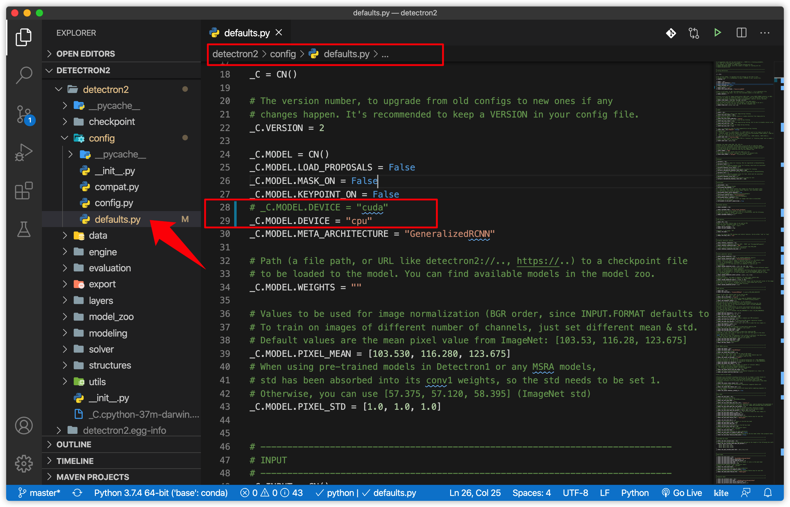

# Street View Panoptic Segmentation with PyTorch and Detectron2

Last update time: 23-June-2020


The Panoptic Segmentation Task is designed to push the state of the art in scene segmentation. Panoptic segmentation addresses both stuff and thing classes, unifying the typically distinct semantic and instance segmentation tasks. The aim is to generate coherent scene segmentations that are rich and complete, an important step toward real-world vision systems such as in autonomous driving or augmented reality.

Find the main results on my blog: [Street View Image Segmentation with PyTorch and Facebook Dectectron2 (CPU+GPU)](https://cuicaihao.com/2020/06/21/street-view-image-segmentation-with-pytorch-and-facebook-detectron2-cpugpu/)

## Installation

- Install [Anaconda Python](https://docs.anaconda.com/anaconda/install/mac-os/) for MacOS.
- Use the `environment.yml` to create the virtual environment and install packages by the following command line:

```bash
# create the virtual environment
conda env create -f environment.yml
# activate the virtual environment; default name is detectron2
conda activate detectron2
```

Note: This `.yml` file is created on my mac-mini by: `conda env export | grep -v "^prefix: " > environment.yml`. It will install pytorch, torchvision, opencv and other needed packages for this practice. If you want to specify a different install path than the default for your system, use the `-p` configuration option: `conda env create -f environment.yml -p /home/user/anaconda3/envs/env_name`

## Install the Detectron2 for MacOS (CPU)

To make the detectron2 installed on your local mac machine, first step is to pull the detectron2 source repository from the Github.

```bash
git clone https://github.com/facebookresearch/detectron2.git
```

Then, open `detectron2/detectron2/config/defaults.py` with your defualt code editor and change the line 28, which tell the compiler that this detectron2 package will be built only for CPU.

```python
# _C.MODEL.DEVICE = "cuda"
_C.MODEL.DEVICE = "cpu"
```



This will avoid bugs when you doing the later notebook on your mac.

Next, navigate back to the root folder, run the following command to install the detectron2 pacakge:

```bash
CC=clang CXX=clang++ python -m pip install -e detectron2
```

You can check your detectron2 package by the following command:

```bash
conda list detectron2
```

the output will looks like this

```bash
#
# Name                    Version                   Build  Channel
detectron2                0.1.3                     dev_0    <develop>
```

## Notebook for Image/Video Segmentation

This to notebook contains all the basic operations with the detectron2 package on your local jupyter notebook (CPU) and Colab notebook (GPU by Google).

1. [CPU macOS (image, video)](./Detectron2_Demo_macOS_CPU.ipynb)
2. [GPU Colab: Detectron2 Tutorial](./Detectron2_Tutorial_Colab_GPU.ipynb) This is original tutorial notebook open this with Colab to enable the GPU.

Reference:
https://github.com/facebookresearch/detectron2

## Image Inference with Pre-trained Model

The simple approach is to pick a model and its config file from a model zoo, for example, mask_rcnn_R_50_FPN_3x.yaml. Detectron2 provides the demo.py that is able to run builtin standard models. Run it with:

```bash
python detectron2/demo/demo.py –config-file detectron2/configs/COCO-PanopticSegmentation/panoptic_fpn_R_101_3x.yaml \
–input input1.jpg input2.jpg \
[–other-options]
–opts MODEL.WEIGHTS detectron2://COCO-InstanceSegmentation/mask_rcnn_R_50_FPN_3x/137849600/model_final_f10217.pkl
```

## Video Inference with Pre-trained Model

The video inference is almost the same as image inference. Just replace –input files with –video-input video-clip.mp4

```bash
python detectron2/demo/demo.py \
–config-file detectron2/configs/COCO-PanopticSegmentation/panoptic_fpn_R_101_3x.yaml \
–video-input  video-clip.mp4 \
–confidence-threshold 0.6 \
–output results/video-output.mkv \
–opts MODEL.WEIGHTS detectron2://COCO-PanopticSegmentation/panoptic_fpn_R_101_3x/139514519/model_final_cafdb1.pkl
```

## Upload and Download file on Colab.

The original Detetron2 Colab notebook already covered the following points:

- Run inference on images or videos, with an existing detectron2 model
- **Train a detectron2 model on a new dataset**

I just want to add a few more points. You can use the following code in Colab which allows you to upload your local image/video to the Colab drive.

```python
from google.colab import files
# upload file to colab drive.
uploaded = files.upload()
for fn in uploaded.keys():
    print(‘User uploaded file “{name}” with length {length} bytes’.format(name=fn, length=len(uploaded[fn])))
# download `fn` from colab drive to your machine.
files.download(‘fn’)
```

Or you can get access of your Google drive by mounting Google Drive locally on Colab with the following command:

```python
from google.colab import drive
drive.mount(‘/content/drive’)
```

## Reference

- [Mapillary Vistas Dataset](https://www.mapillary.com/dataset/vistas?pKey=ewNCiHkcV_72yeGFx3MFuA&lat=-34.34450392965353&lng=150.59045187089282&z=2.198575657109827)
- [Facebook Detectron2](https://ai.facebook.com/blog/-detectron2-a-pytorch-based-modular-object-detection-library-/)
